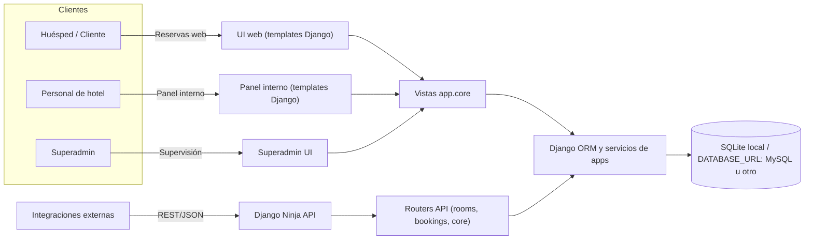

# Arquitectura del Sistema

Este documento resume la arquitectura de la plataforma hotelera, destacando el contexto de interacción, los componentes internos basados en Django/Django Ninja y el flujo de datos desde las peticiones web/API hasta la persistencia en SQLite o MySQL.

## Diagrama de contexto



## Diagrama de componentes

```mermaid
flowchart TB
    subgraph Configuración
        Settings[config/settings.py\nConfiguración DB, templates, static]
        Urls[config/urls.py\nEnrutamiento web y API]
    end

    subgraph Presentación (Templates)
        Templates[templates/*\nLayouts y páginas UI]
    end

    subgraph API REST (Django Ninja)
        NinjaAPI[NinjaAPI principal]
        RoomsAPI[app.rooms.api]
        BookingsAPI[app.bookings.api]
        CoreAPI[app.core.api]
    end

    subgraph Aplicaciones Django
        Accounts[app.accounts\nAuth y perfiles]
        Rooms[app.rooms\nHabitaciones y disponibilidad]
        Bookings[app.bookings\nReservas y pagos]
        Clients[app.clients\nGestión de clientes]
        Cleaning[app.cleaning\nTareas de limpieza]
        Maintenance[app.maintenance\nIncidencias y reparaciones]
        Administration[app.administration\nParámetros operativos]
        Superadmin[app.superadmin\nMulti-hotel y auditoría]
        Core[app.core\nHome, dashboards y utils comunes]
    end

    Settings --> Urls
    Urls --> Templates
    Urls --> NinjaAPI
    Urls --> Core
    NinjaAPI --> RoomsAPI & BookingsAPI & CoreAPI
    RoomsAPI --> Rooms
    BookingsAPI --> Bookings
    CoreAPI --> Core
    Templates --> Core
    Core --> Accounts & Rooms & Bookings & Clients & Cleaning & Maintenance & Administration & Superadmin
```

## Flujo de datos end-to-end

1. **Peticiones web (HTML):**
   - Las rutas declaradas en `config/urls.py` dirigen las peticiones a vistas en `app.core.views` o vistas específicas de apps (por ejemplo, `app.bookings.views`).
   - Las vistas usan templates en `templates/` para renderizar la respuesta HTML y pueden consumir datos de servicios/ORM de cada app.
2. **Peticiones API (REST/JSON):**
   - `NinjaAPI` definido en `config/urls.py` expone routers de `app.rooms.api`, `app.bookings.api` y `app.core.api` para operaciones CRUD y consultas.
   - Los endpoints validan input con esquemas Ninja/Pydantic, ejecutan lógica de negocio en las apps y retornan respuestas JSON.
3. **Lógica de dominio y persistencia:**
   - Cada app Django define modelos (Django ORM) y, en algunos casos, servicios auxiliares para encapsular reglas de negocio.
   - El ORM traduce operaciones a SQL sobre SQLite por defecto o sobre el motor especificado en `DATABASE_URL` (MySQL/PostgreSQL).
4. **Autenticación y sesiones:**
   - Las vistas web usan el middleware y las vistas de autenticación de Django para login/logout y protección CSRF.
   - Las APIs pueden reutilizar autenticación basada en sesión o tokens según configuración, permitiendo control de acceso unificado.
5. **Integraciones y exportaciones:**
   - Vistas específicas exponen exportaciones CSV y dashboards (por ejemplo, en `app.bookings.views` y `app.rooms.views`), reutilizando el mismo ORM y contexto de permisos.

## Puntos de entrada clave

- **Enrutamiento web y API:** `config/urls.py` registra vistas HTML y routers Ninja que conectan con cada app de dominio.
- **Configuración de base de datos y assets:** `config/settings.py` define la base de datos por defecto SQLite y opcionalmente parsea `DATABASE_URL`, además de registrar `templates/` para la UI.
- **Apps de dominio:** módulos en `app/*` encapsulan modelos, vistas y lógica relacionada (habitaciones, reservas, clientes, limpieza, mantenimiento, administración y superadmin).

## Dependencias y patrones críticos

| Área | Dependencia/Patrón | Uso principal |
| --- | --- | --- |
| Framework web | Django 5.x | Enrutamiento, vistas, middleware, gestión de usuarios y sesiones. |
| API REST | Django Ninja | Definición de routers (`app.rooms.api`, `app.bookings.api`, `app.core.api`) y validación con esquemas. |
| Persistencia | Django ORM | Modelado de habitaciones, reservas, clientes, etc., con migraciones y abstracción SQL. |
| Bases de datos | SQLite (desarrollo) / `DATABASE_URL` (MySQL/PostgreSQL) | Ejecución de queries generadas por el ORM según el motor configurado. |
| Autenticación | Sistema de auth de Django | Login/logout, permisos y protección CSRF en vistas y APIs compatibles. |
| Validación | Validadores de Django + esquemas Ninja | Validación de formularios web y payloads JSON antes de ejecutar lógica de negocio. |
| Templates estáticos | Motor de templates Django + assets en `templates/` | Render de la UI de paneles y portal de clientes con componentes reutilizables. |

## Referencias rápidas

- **Rutas y API Ninja:** ver `config/urls.py` para la composición de routers y vistas. 【F:config/urls.py†L18-L81】
- **Configuración de base de datos y templates:** ver `config/settings.py` para la configuración de SQLite y soporte opcional de `DATABASE_URL`. 【F:config/settings.py†L105-L137】
- **Templates base:** los layouts y páginas están en el directorio `templates/` usado por el motor de Django. 【F:README_WEB.md†L73-L98】
