# Modelo de Datos y Flujos Clave

Este documento resume el modelo de datos propuesto para Hotel O11CE y muestra las secuencias principales del ciclo de vida de una reserva. Los módulos y áreas mencionados corresponden a los listados en `docs/README.md` (MVP – Nivel 1) y en `README_WEB.md` (Interfaz Web y módulos principales).

## Diagrama Entidad–Relación (ER)

```mermaid
erDiagram
    USER ||--o{ BOOKING : crea
    USER ||--o{ PAYMENT : realiza
    ROOM ||--o{ BOOKING : asigna
    BOOKING ||--o{ PAYMENT : genera
    BOOKING ||--o{ CHECKIN : tiene
    BOOKING ||--o{ CHECKOUT : cierra
    ROOM ||--o{ MAINTENANCE_REQUEST : bloquea

    USER {
        int id
        string username
        string email
        string role "admin | recepcionista | cliente"
    }
    ROOM {
        int id
        string number
        string type "single | double | suite"
        string status "libre | ocupada | limpieza | mantenimiento"
        int capacity
        decimal base_price
    }
    BOOKING {
        int id
        date check_in_date
        date check_out_date
        int guests
        string status "pendiente | confirmada | checkin | checkout | cancelada"
        int room_id
        int user_id
        datetime created_at
    }
    PAYMENT {
        int id
        decimal amount
        string method "tarjeta | efectivo | transferencia"
        string status "pendiente | pagado | reembolsado"
        int booking_id
        int user_id
        datetime created_at
    }
    CHECKIN {
        int id
        datetime performed_at
        string method "online | frontdesk"
        int booking_id
        int user_id
    }
    CHECKOUT {
        int id
        datetime performed_at
        decimal extras
        int booking_id
        int user_id
    }
    MAINTENANCE_REQUEST {
        int id
        string issue
        string priority
        string status "abierta | en_progreso | resuelta"
        int room_id
        datetime reported_at
    }
```

**Cobertura de módulos:**
- **Recepción / Reservas / Habitaciones**: Relaciones entre `USER`, `BOOKING`, `ROOM`, `CHECKIN`, `CHECKOUT` sustentan los flujos descritos en `docs/README.md` y `README_WEB.md`.
- **Usuarios/Roles**: `USER.role` refleja los perfiles `admin` y `recepcionista` mencionados en el MVP.
- **Administración / Pagos**: `PAYMENT` vincula reservas con el registro de pagos básico.
- **Mantenimiento**: `MAINTENANCE_REQUEST` permite bloquear o habilitar habitaciones según el módulo de mantenimiento.

## Secuencias UML de Flujos Clave

### 1. Reserva Web (cliente)

### 2. Check-in / Check-out (recepción)

### 3. Cancelación de reserva

## Notas de implementación
- Las entidades reflejan los módulos funcionales descritos en `docs/README.md` y `README_WEB.md`, facilitando el mapeo entre tablas y componentes web.
- Los estados propuestos permiten cubrir el flujo end-to-end: reserva (cliente), check-in/out (recepción) y cancelación con pagos/reembolsos (administración).
- El diagrama ER puede extenderse con tablas auxiliares (limpieza, reportes, marketing) siguiendo la estructura modular de la documentación existente.
