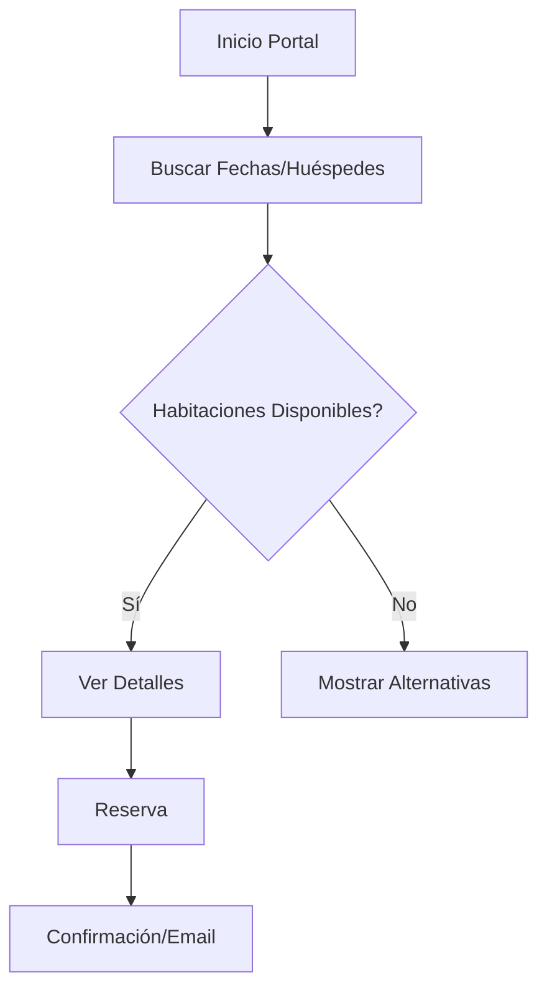
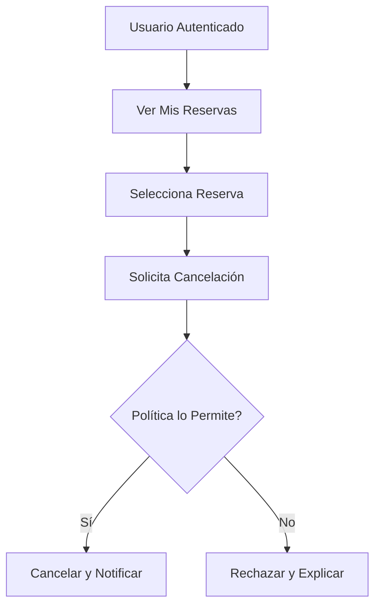
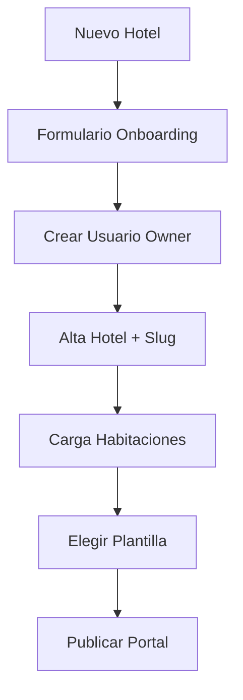

# Documentación Técnica — HOTEL SYSTEM

> Índice: [Introducción](#introducción) · [Modelo SaaS / Multi-tenancy](#modelo-saas--multi-tenancy) · [Roles y permisos](#roles-y-permisos) · [Referencia de API](#referencia-de-api) · [Integración IA/n8n](#integración-ia-n8n) · [Modelo de Datos (ER) y Estados](#modelo-de-datos-er-y-estados) · [Detalles Técnicos](#detalles-técnicos) · [Instalación y Configuración](#instalación-y-configuración) · [Semilla de Datos y Pruebas](#semilla-de-datos-y-pruebas) · [Despliegue](#despliegue) · [Manual de Uso](#manual-de-uso) · [Logging / Auditoría](#logging--auditoría) · [Lifecycle del Hotel](#lifecycle-del-hotel) · [Desarrolladores](#documentación-para-desarrolladores) · [Versionado y Evolución](#versionado-y-evolución) · [Troubleshooting](#troubleshooting)

## Introducción

### Objetivos del Proyecto
- Proveer un SaaS de reservas para hoteles con portal público y panel interno.
- Reducir sobreventa y mejorar confirmaciones mediante flujos claros y auditables.
- Ofrecer analítica y recomendaciones operativas vía integración IA.
- Escalabilidad por hotel/cadena y plantillas visuales configurables desde BD.

### Alcance Funcional
- Portal de reservas público con búsqueda por fechas y huéspedes.
- Gestión interna de habitaciones, precios y reservas.
- Dashboard con KPIs y listados por fecha/estado.
- Onboarding de hoteles y selección de plantilla visual.
- Integración IA para análisis y recomendaciones.

### Requisitos Previos
- Python 3.11+ y pip.
- Base de datos (SQLite para desarrollo, PostgreSQL recomendado en producción).
- Entorno con variables de entorno para claves y configuración.
- Navegador moderno (Chrome/Firefox/Edge).

### Diagrama de Arquitectura General
```mermaid
graph TD
    A[Cliente (Navegador)] --> B[Django Templates]
    B --> C[Views / Controllers]
    C --> D[API (Django)]
    C --> E[Servicios Internos]
    D --> F[(Base de Datos)]
    E --> G[n8n Webhook]
    G --> H[Proveedor IA]
    C --> I[Static Files (CSS/JS/Imgs)]
```

## Detalles Técnicos

### Especificaciones de Implementación
- Backend: Django 5.2.x
- Templates: Django templates con sistema de selección de plantilla por `hotel.template_id`.
- Apps: `app.core`, `app.bookings`, `app.rooms`, `app.clients`, `app.administration`, `app.maintenance`, `app.cleaning`.
- Seguridad: Auth de Django, vistas protegidas por decoradores, CSRF activo.
- Estáticos: carpeta `static/` registrada en configuración para servir CSS/JS/Imgs.
- Diseño "Booking-like": carpeta `templates/diseño-bocking/` con `base.html` y `home.html`.

Referencias de código:
- Configuración de estáticos: `config/settings.py:172–179`.
- Selección de plantilla de hotel: `app/core/views.py:435–441`.
- Template base: `templates/diseño-bocking/base.html`.
- Estilos: `static/diseño-bocking/styles.css`.

### Diagramas de Flujo — Procesos Clave

Reserva Web (Portal):


Cancelación:


Onboarding de Hotel:


### Estructura de Directorios y Archivos
```
hotel-1/
├─ app/
│  ├─ core/
│  ├─ bookings/
│  ├─ rooms/
│  ├─ clients/
│  ├─ administration/
│  ├─ maintenance/
│  └─ cleaning/
├─ config/
│  ├─ settings.py
│  └─ urls.py
├─ templates/
│  └─ diseño-bocking/
│     ├─ base.html
│     └─ home.html
├─ static/
│  └─ diseño-bocking/
│     └─ styles.css
└─ docs/
   └─ TECNICO.md
```

### Dependencias y Versiones Requeridas
- Django ≥ 5.2.4
- python-decouple ≥ 3.8
- dj-database-url ≥ 2.1 (opcional para `DATABASE_URL`)
- django-cors-headers ≥ 4.4
- Font Awesome (CDN) y Google Fonts: Inter

## Instalación y Configuración

### Requisitos del Sistema
- Windows/macOS/Linux
- Python 3.11+
- SQLite integrado (dev) / PostgreSQL (prod)

### Pasos Detallados de Instalación
1) Crear entorno virtual
```
python -m venv .venv
```
2) Activar entorno
- Windows: `.
venv\Scripts\activate`
- macOS/Linux: `source .venv/bin/activate`
3) Instalar dependencias
```
pip install -r requirements.txt
```
4) Migraciones
```
python manage.py migrate
```
5) Crear superusuario
```
python manage.py createsuperuser
```
6) Ejecutar servidor
```
python manage.py runserver
```

### Configuraciones Recomendadas
- `DEBUG`: `True` en desarrollo, `False` en producción.
- `ALLOWED_HOSTS`: lista de dominios permitidos.
- `CSRF_TRUSTED_ORIGINS`: dominios para CSRF en producción.
- Email: configurar `EMAIL_*` para notificaciones reales.

### Variables de Entorno Necesarias
- `DJANGO_SECRET_KEY`: clave secreta.
- `DATABASE_URL`: cadena de conexión (opcional; usa SQLite si no está).
- `SQLITE_PATH`: path alternativo de SQLite (opcional).
- `N8N_IA_WEBHOOK_URL`: webhook para análisis IA.

## Manual de Uso

### Funcionalidades Principales
- Portal de reservas: búsqueda, selección y confirmación.
- Panel interno: CRUD de habitaciones y reservas.
- Dashboard: KPIs, ocupación y cancelaciones.
- IA: endpoint de análisis con recomendaciones.

### Ejemplos de Uso (Casos Prácticos)
- Buscar disponibilidad:
  - Portal → Seleccionar fechas y huéspedes → Ver resultados → Reservar.
- Gestionar habitaciones:
  - Panel → Habitaciones → Crear/Editar → Guardar.
- Revisar reservas:
  - Panel → Reservas → Filtrar por fecha/estado → Exportar.

### Capturas de Pantalla Relevantes
- Portal de reservas (home): hero, formulario, habitaciones destacadas.
- Detalle de habitación: galería, características, precio.
- Panel: listados y formularios.

### Limitaciones Conocidas
- Multimoneda y reglas fiscales avanzadas pendientes.
- Optimización de imágenes en producción (CDN recomendado).
- Internacionalización avanzada (i18n/l10n) por completar.

## Documentación para Desarrolladores

### Convenciones de Código
- Python: PEP8, imports ordenados, funciones puras cuando aplique.
- Django: views claras, templates semánticos, contextos explícitos.
- CSS: variables y utilidades centralizadas; clases BEM; transiciones con `transform/opacity`.

### Guía de Contribución
- Branching: `feature/*`, `fix/*`, `chore/*`.
- Commits: mensajes claros en imperativo.
- PRs: descripción, pruebas y checklist de revisión.

### Proceso de Testing
- Tests unitarios para servicios y modelos.
- Tests de integración para flujos de reserva.
- Comando:
```
python manage.py test
```

### Pipeline de CI/CD (Propuesta)
- Jobs: `lint` → `tests` → `build` → `deploy`.
- Gates: bloquear `main` si fallan tests.
- Artefactos: reportes de cobertura y build de estáticos.

## Troubleshooting

### Problemas Comunes y Soluciones
- CSS 404 en portal:
  - Causa: carpeta `static/` no registrada.
  - Solución: validar `STATIC_URL = '/static/'` y `STATICFILES_DIRS = [BASE_DIR / 'static']` (`config/settings.py:172–179`).
- Migraciones faltantes:
  - Ejecutar `python manage.py makemigrations` y `python manage.py migrate`.
- Variables de entorno no aplicadas:
  - Revisar `.env`/entorno, reiniciar servidor.
- CSRF en producción:
  - Configurar `CSRF_TRUSTED_ORIGINS` y `ALLOWED_HOSTS`.

### Pasos de Diagnóstico
1) Revisar logs del servidor (`runserver`).
2) Confirmar rutas y permisos de archivos estáticos.
3) Verificar conexión de base de datos.
4) Probar endpoints críticos con usuario de prueba.

---
## Modelo SaaS / Multi-tenancy

### Concepto
El sistema opera como un SaaS multi-hotel. Cada entidad funcional (`Room`, `Booking`, `Client`) se asocia a un `Hotel` mediante `hotel_id`. Esto garantiza aislamiento de datos por cliente.

### Scoping de datos
- Asociación explícita en modelos:
  - `Room.hotel` en `app/rooms/models.py:24–31`
  - `Booking.hotel` en `app/bookings/models.py:28–33`
  - `Client.hotel` en `app/clients/models.py:69–73`
- Aislamiento lógico en vistas y consultas: filtros por `hotel` en panel y portal.

### Resolución de hotel activo
- Web pública con rutas slug-based: `h/<hotel_slug>/...` definidas en `config/urls.py:447–463,465–469`.
- Panel del hotel: `panel/<hotel_slug>/...` en `config/urls.py:495–504`.
- Superadmin: rutas bajo `superadmin/` para administración global en `config/urls.py:506–519`.

### Diferenciación de paneles
- Panel Hotel (owner/staff): gestión acotada al `hotel_slug`/`hotel_id`.
- Panel Superadmin: visión global, bloqueo/desbloqueo de hoteles, auditoría y métricas.

## Roles y permisos

### Roles del sistema
- `superadmin`: acceso completo a métricas y auditoría global.
- `hotel_owner`: controla su hotel (habitaciones, reservas, clientes).
- `hotel_staff`: soporte operativo con permisos limitados.
- `client`: acceso a portal y sus reservas.

### Implementación
- Asociación a hotel del staff/owner:
  - `HotelAdmin` y `HotelStaff` en `app/administration/models.py:57–83`.
- Scoping por hotel en vistas del panel usando `hotel_slug`.
- Checks típicos: decoración por grupo/rol y verificación de pertenencia a hotel en cada acción crítica (ej. cambio de estado).

### Accesos por rol (resumen)
- Superadmin: `/superadmin/*`, `/superadmin/api/*`.
- Hotel owner/staff: `/panel/<hotel_slug>/*`.
- Client: `/h/<hotel_slug>/portal/*` + APIs públicas pertinentes.

## Referencia de API

### Web pública (portal)
- `GET /h/<hotel_slug>/reservar/` — Muestra formulario de reserva.
- `POST /h/<hotel_slug>/confirmar-reserva/` — Confirma reserva con payload básico.
- Proceso multi-paso (si aplica):
  - `GET /h/<hotel_slug>/portal/booking/step1/`
  - `GET /h/<hotel_slug>/portal/booking/step2/`
  - `GET /h/<hotel_slug>/portal/booking/step3/`
  - `GET /h/<hotel_slug>/portal/booking/step4/`

### Panel hotel (operaciones)
- `GET /panel/<hotel_slug>/reservas/` — Listado y filtros.
- `POST /panel/<hotel_slug>/reservas/<id>/cambiar-estado/` — Transición de estado controlada.
- `GET /panel/<hotel_slug>/habitaciones/`, `GET /panel/<hotel_slug>/clientes/` — Gestión asociada al hotel.

### Superadmin (API)
- `GET /superadmin/api/dashboard/global` — KPIs globales.
- `GET /superadmin/api/dashboard/hotel/<id>` — KPIs por hotel.
- `POST /superadmin/api/ia/analisis/` — Envío de datos agregados a IA.
- `GET /superadmin/api/hotels` — Listado de hoteles.

### Especificaciones de endpoints

Formato genérico de error:
```
{ "error": "mensaje descriptivo" }
```

Ejemplo `POST /superadmin/api/ia/analisis/`:
Request (JSON):
```
{
  "meta": {"period": "2025-11", "hotel": null},
  "kpis": {"reservas": 120, "canceladas": 15, "ocupacion": 0.72},
  "series": [{"date": "2025-11-01", "reservas": 4}],
  "distributions": {"por_tipo": {"suite": 10, "double": 40}},
  "question": "¿Cómo mejorar ocupación el fin de semana?"
}
```
Response (JSON):
```
{
  "answer": "Revisa precios dinámicos y paquetes con desayuno.",
  "recommendations": [
    "Ajusta tarifas viernes-domingo",
    "Promueve suites con 10% descuento"
  ]
}
```

## Integración IA/n8n

### Endpoint backend
- `POST /superadmin/api/ia/analisis/` implementa el llamado a webhook n8n usando `call_n8n_ia_analyst`.
- Servicio: `app/core/services_ia.py:15–66`.

### Contrato de intercambio
- Payload enviado: `{meta, kpis, series, distributions, question}`.
- Tiempo de espera: hasta 30s (`urlopen(..., timeout=30)`).
- Respuesta esperada: JSON con claves `answer` y `recommendations` (string/lista).
- Manejo de errores: `IAServiceNotConfigured`, `IAServiceError` con mensajes descriptivos.

### Reglas de parseo
- Intenta parseo JSON estricto.
- Normaliza comillas simples si la respuesta no es JSON válido.
- Detecta respuestas de webhook por defecto y advierte sobre configuración de `Respond to Webhook`.

### Ejemplo completo
Request → n8n → Response validada en `app/core/services_ia.py:45–66`.

## Modelo de Datos (ER) y Estados

### Diagrama ER (simplificado)
```
classDiagram
  class Hotel {
    +id
    +slug
    +name
    +is_blocked
    +plan_name
    +subscription_status
    +template_id
  }
  class Room {
    +id
    +hotel_id
    +number
    +type
    +capacity
    +status
    +price
  }
  class Client {
    +id
    +user_id
    +hotel_id
    +first_name
    +last_name
    +email
    +dni
  }
  class Booking {
    +id
    +hotel_id
    +client_id
    +room_id
    +check_in_date
    +check_out_date
    +status
    +payment_status
    +total_price
  }
  Hotel "1" --> "*" Room
  Hotel "1" --> "*" Client
  Hotel "1" --> "*" Booking
  Room "1" --> "*" Booking
  Client "1" --> "*" Booking
```

### Máquina de estados de Booking
```
stateDiagram-v2
  [*] --> pending
  pending --> confirmed
  confirmed --> completed
  confirmed --> cancelled
  pending --> cancelled
  confirmed --> no_show
  cancelled --> [*]
  completed --> [*]
  no_show --> [*]
```
- Estados definidos en `app/bookings/models.py:13–26`.
- Transiciones implementadas en métodos: `confirm_booking`, `cancel_booking`, `complete_booking` (`app/bookings/models.py:179–207`).

## Semilla de Datos y Pruebas

### Comando de seed base
- `python manage.py seed_o11ce [--reset] [--skip_base] [--random_hotels N] [--bookings_min M] [--bookings_max X]`
- Implementación: `app/core/management/commands/seed_o11ce.py`.

### Qué crea
- Hotel O11CE (`slug=o11ce`) y hotel demo (`slug=demo-mini`).
- Habitaciones por tipo y precio.
- Reservas distribuidas en ventana relativa a hoy, con estados variados.
- Hoteles aleatorios con reservas si se especifica `--random_hotels`.

### Validación del MVP
- Probar dashboard global/hotel via API:
  - `GET /superadmin/api/dashboard/global`
  - `GET /superadmin/api/dashboard/hotel/<id>`
- Probar IA:
  - `POST /superadmin/api/ia/analisis/` con payload de KPIs del seed.

## Despliegue

### Entornos
- Desarrollo: `runserver`, SQLite, DEBUG=True.
- Producción: PostgreSQL, DEBUG=False.

### Stack recomendado (VPS/Docker)
- App: Django + Gunicorn.
- Proxy: Nginx sirviendo `/static` y proxy a Gunicorn.
- Base: PostgreSQL gestionado.

### Backups
- DB: `pg_dump` programado.
- Estáticos: sincronización a almacenamiento externo.

### Variables sensibles
- Gestionar por `.env`/panel del proveedor (Railway/Render/VPS).

## Logging / Auditoría

### Modelos de auditoría
- `ActionLog`: registra acciones con usuario, hotel, IP y agente (`app/core/models.py:5–34`).
- `EmailLog`: seguimiento de emails enviados, estado y errores (`app/core/models.py:35–102`).

### Eventos críticos
- Creación/cambio de reservas.
- Ejecución de endpoint IA (éxito/fallo).
- Bloqueo/desbloqueo de hotel.

### Dónde ver los logs
- Admin de Django.
- Consola (`runserver`).
- Consultas sobre modelos en panel superadmin.

## Lifecycle del Hotel

### Estados del cliente SaaS
- `subscription_status`: `trial`, `active`, `blocked`, `cancelled` (`app/administration/models.py:13–23,33–36`).
- Sincronización de bloqueo: `Hotel.sync_block_from_subscription()` (`app/administration/models.py:51–56`).

### Comportamiento por estado
- `trial/active`: acepta reservas.
- `blocked/cancelled`: no acepta nuevas reservas; portal puede operar en solo lectura.

## Versionado y Evolución

### Versionado
- Endpoints documentados como `v1` (convención documental).
- Breaking changes se registrarán en CHANGELOG (futuro).

### Roadmap técnico mínimo
- Pagos (pasarela y conciliación).
- Multi-idioma e internacionalización.
- Channel manager (conexión a OTAs).
- Mejora de prompts y scoring de IA.

---

© HOTEL SYSTEM — Documento Técnico. Versión 1.0.0.